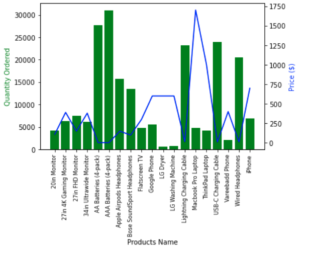

# Electronics Store Sales Analysis

Analysis and solving business questions over randomly generated buy-sell data of an electronic store for the year of 2019  in USA. The jupyter notebook file is [here](./analysis.ipynb)

## Question 1: What was the best month for sales? How much was earned that month?

Most of the items sold in the month number 12 (December). In that month, the sales were more than 4 million dollars. 

## Question 2: What city had the highest number of sales?

San Francisco (CA) having more than 8 million dollars in sales is the highest revenue generator. 

## Question 3: What time should we display advertisements to maximize likelihood of customer's buying product?

Most number of customers tend to buy products at 11 am (11) and 7 pm (19). So, the advertisements should be displayed before 11 am and 7 pm to maximize the likelihood of customer's buying product

## Question 4: What products are most often sold together?

We can see that customers bought iPhone and Lightning Charging Cable on most number of occassions. These combo items can be given offers in different promotional contents to the customers.

## Question 5: What product sold the most? What can be the reason behind it?

AA and AAA battery packs were sold most (green bars) because their price is comparatively lesser then other products (follow blue line). On the contrary, the price of macbook pro laptop and thinkpad laptop were among the highest. As a result, these products were sold in moderate numbers

